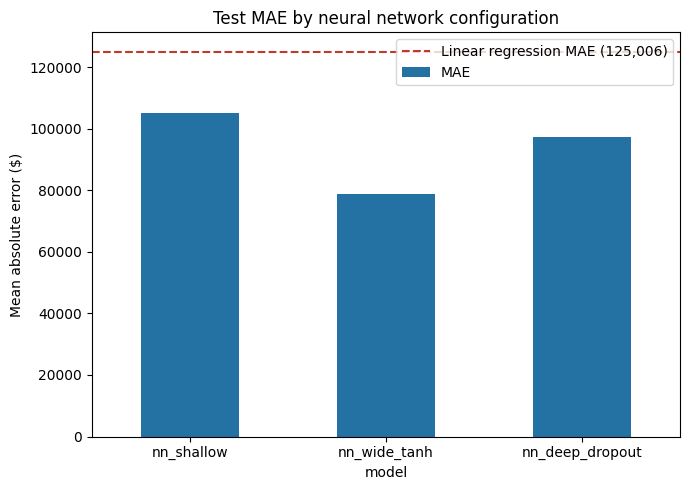
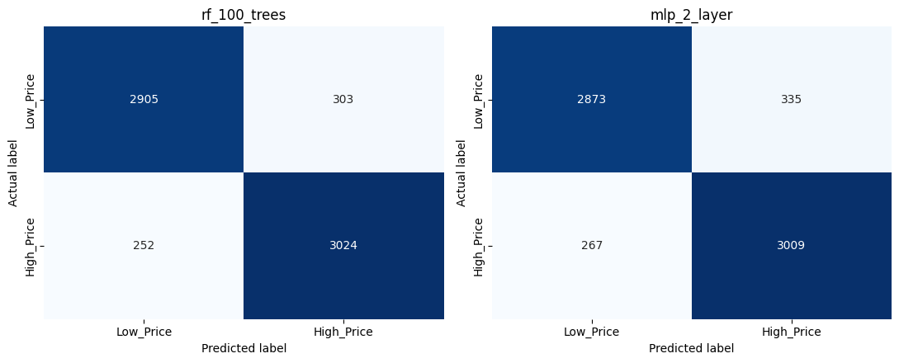
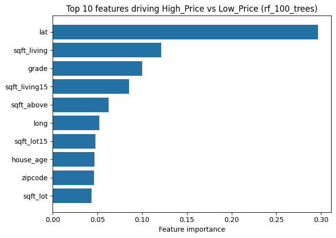

# King County House Price Prediction

Regression and classification models for residential real estate, built on the King County (Seattle area) house sales data set of 21,613 transactions.

Two related problems are addressed:

1. **Price estimation**: predict the exact sale price of a house from its physical and location attributes.
2. **Price band classification**: label a house as `High_Price` ($450,000 or more) or `Low_Price` (below that), and predict the label directly.

Rather than tuning a single model by trial and error, each problem is worked through with several model configurations trained and evaluated under the same conditions, so the comparison between architectures is part of the evidence, not an afterthought.

## Results

**Price estimation**: linear regression compared against three neural network configurations (scikit-learn + Keras).

| Model | Hidden layers | MAE ($) | R² |
|---|---|---|---|
| Linear regression | n/a | 125,006 | 0.693 |
| nn_shallow | 64, 32 (relu) | 105,056 | 0.779 |
| **nn_wide_tanh** | 100 (tanh), 80 (relu) | **80,004** | **0.851** |
| nn_deep_dropout | 128, 64, 32 (relu, dropout 0.2) | 98,333 | 0.808 |



**Price band classification**: random forest compared against a multilayer perceptron, three configurations each.

| Model | Accuracy | Precision | Recall | F1 |
|---|---|---|---|---|
| **rf_100_trees** | **91.4%** | 90.9% | 92.3% | 91.6% |
| rf_300_trees | 91.4% | 90.9% | 92.2% | 91.6% |
| rf_300_trees_depth10 | 91.1% | 90.6% | 91.8% | 91.2% |
| mlp_1_layer | 89.1% | 88.8% | 89.7% | 89.3% |
| mlp_2_layer | 90.7% | 90.0% | 91.8% | 90.9% |
| mlp_3_layer | 90.6% | 91.7% | 89.5% | 90.6% |



Every random forest configuration outperforms every neural network configuration on this task. Random forest also exposes a feature importance ranking, which a neural network does not give directly:



Latitude, living area and the King County grade score are the strongest predictors of whether a house lands above or below the price threshold.

## Approach

- **Feature engineering**: the raw sale date is converted into `house_age` (years between construction and sale) and `is_renovated` (a flag from `yr_renovated`), replacing the original date fields.
- **Split**: a 70/30 train/test split with a fixed random seed, so results are reproducible.
- **Scaling**: MinMax scaling for the regression inputs, standard scaling for the classification inputs, fitted on the training set only.
- **Regression models**: linear regression baseline, plus three Keras architectures varying depth, activation function and optimizer, each trained with early stopping on validation loss.
- **Classification models**: random forest (three settings for tree count and max depth) and a multilayer perceptron (three settings for hidden layer count and width).
- **Evaluation**: MAE, MSE and R² for regression; accuracy, precision, recall and F1 for classification, plus confusion matrices and a feature importance chart for the best classifier.

## Repository structure

```
real_estate_price_prediction.ipynb   Full analysis: notebook, ready to run end to end
real_estate_price_prediction.pdf     Rendered notebook with all outputs, for a quick read
requirements.txt                     Python dependencies
data/                                Place Part1_house_price.csv here (see below)
images/                              Chart exports used in this README
```

## Running it

```bash
pip install -r requirements.txt
```

Download `Part1_house_price.csv` from the [Kaggle House Sales in King County data set](https://www.kaggle.com/datasets/harlfoxem/housesalesprediction) and place it in a `data/` folder next to the notebook (the raw file is not redistributed in this repo). Then run `real_estate_price_prediction.ipynb` top to bottom.

## Background

This project started as a university assignment on tabular data analytics and was rebuilt afterwards: the train/test split bug was fixed, single arbitrary model configurations were replaced with multi configuration comparisons, redundant code was removed, and the write up was rewritten from scratch. Every result in the notebook comes from an actual end to end run, not a placeholder.
